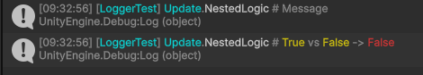

# Unity Logger
A wrapper around Unity's default logging system, designed to produce more structured and readable logs.

## Features
- Automated context detection (class and method names)
- Helper methods for value comparison

## Installation
### Via Package Manager (Git URL)
https://github.com/Metacometa/UnityLogger.git#assetstore
> Tracks the latest state of the `assetstore` branch.  

## Quick Start
Use the class `UnityLogger` from the `Kiranchy.UnityLogger` namespace instead of `UnityEngine.Debug.Log`.

## Example

### Input
```csharp
UnityLogger.AutoLog(this, "Message");
UnityLogger.AutoCompare(this, a, b);   
```

### Output
